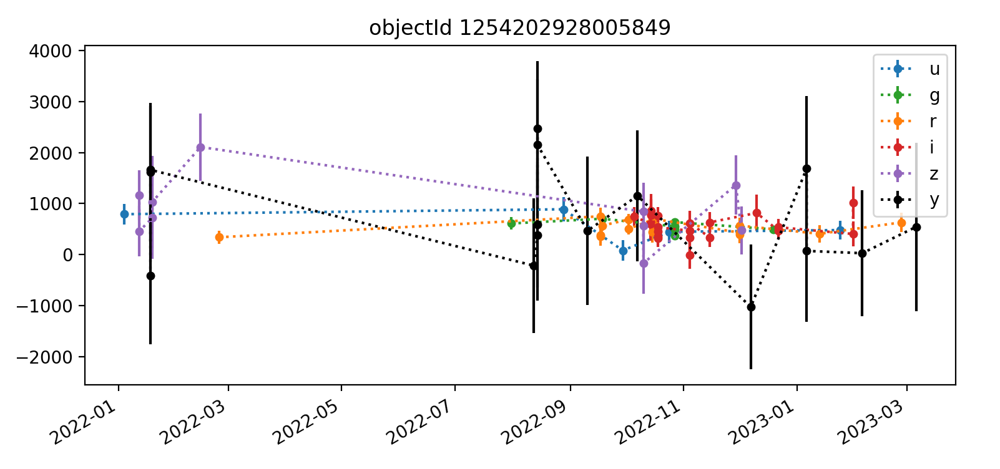
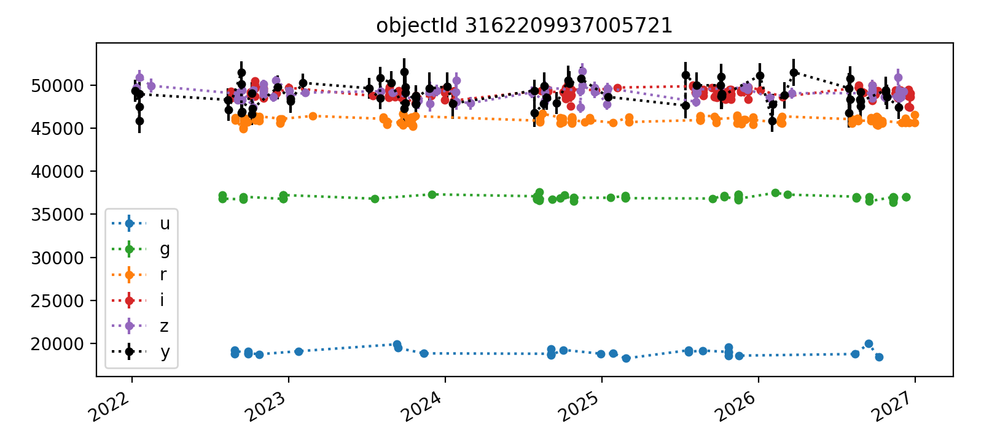
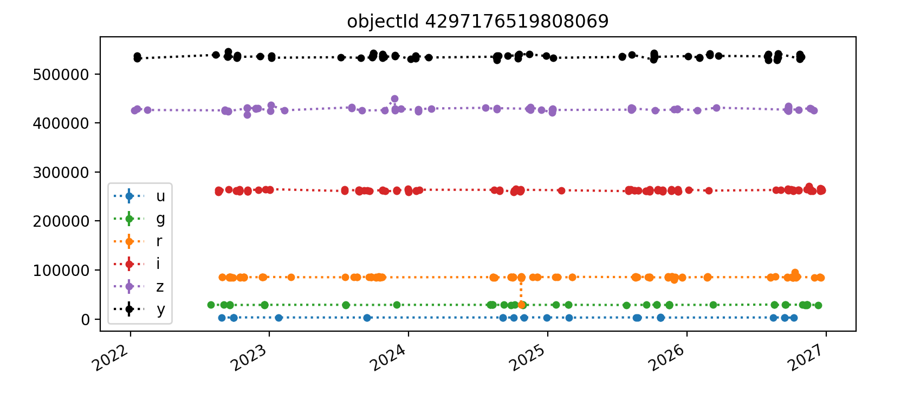

.. _section-forced-photometry:

Light curves from forced photometry
===================================

The test data for this investigation is three tracts of simulated data stored in the ``data-int`` cloud.
All datasets were processed through the Data Release Production pipeline using LSST Science Pipelines ``v23_0_0_rc2``.
The data products analyzed here reside in two Butler collections: ``2.2i/runs/test-med-1/v23_0_0_rc2/PREOPS-863`` (tracts 3828 and 3829 with shallower depth, i.e., fewer visits) and ``2.2i/runs/test-tract4431/v23_0_0_rc2/PREOPS-728`` (tract 4431 with a five-year depth, i.e., more visits).
All datasets use the standard ``DC2`` skymap with the ``LSSTCam-imSim`` instrument and contain patches from 0 to 48.
However, it is important to note that not every patch necessarily contains visits that span the full depth of all the observations.

To inspect the quality of forced photometry in these data, we use the Butler to load two dataset types, `forced source tables <https://github.com/lsst/pipe_tasks/blob/main/schemas/ForcedSource.yaml>`__ (``forcedSourceTable``) and CCD visit tables (``ccdVisitTable``).
The former contains one row per image source, with information like bandpass and PSF flux measurements.
The latter contains one row per detector-visit pair, and we use this to retrieve the time of observation for each forced source.

A sample light curve for a single object is in :numref:`fig-lc-example1`.
The term "object" refers to an astrophysical object, while a "source" refers to a single detection or measurement of that astrophysical object, typically on a processed visit image.
The photometry performed here is "forced" because it measures flux at a predetermined location where the object is expected to be rather than measuring the location of a PSF peak.

lack (y-band) points have the largest error bars. Not every epoch has a measured flux point. There are roughly 10-20 points per band and most have values between 0 and 1000.

    Light curve for one object in DC2 tract 3828. The y-axis shows ``psfFlux`` with ``psfFluxErr`` error bars, in units of nJy. Point colors correspond to bands, and dashed lines are to guide the eye.

We did experiment with computing two variability metrics: the weighted coefficient of variation and the median absolute deviation.
The former uses the flux error whereas the latter relies on median statistics to quantify variability.

As an example, we computed that the light curve above has the following properties:

.. _table-var-example1:

.. table:: Variability of object 1254169105138881

    +------+-------+--------------------+----------------+
    | band | N obs | weighted coeff var | median abs dev |
    +======+=======+====================+================+
    | u    |     9 |              0.566 |         159.88 |
    +------+-------+--------------------+----------------+
    | g    |     9 |              0.171 |          34.92 |
    +------+-------+--------------------+----------------+
    | r    |    19 |              0.449 |          96.18 |
    +------+-------+--------------------+----------------+
    | i    |    26 |              0.682 |         200.22 |
    +------+-------+--------------------+----------------+
    | z    |     9 |              0.503 |         295.28 |
    +------+-------+--------------------+----------------+
    | y    |    14 |              1.124 |         367.64 |
    +------+-------+--------------------+----------------+

Each is a per-object metric rather than a per-source metric, and therefore does not appear in the forced source table.
This kind of analysis and subsequent plots should be written as a Pipeline Task since it is not feasible to run for more than a few thousand objects at a time within an analysis notebook.

In Section :ref:`section-big-data-big-memory`, we show some aggregate results from inspecting fluxes in a handful of patches in the three tracts described above.
In Section :ref:`section-light-curve-sample`, we describe a closer look at a very small subset of object light curves.
Finally, we discuss the additional tooling and analysis work necessary to more fully vet forced photometry light curve data products.

.. _section-big-data-big-memory:

Big data, big memory challenges
-------------------------------

The forced source tables exist on a per-patch basis. While each tract has 49 patches of data, loading even the bare minimum of columns into memory (via pandas for analsis in a jupyter notebook, for instance) is prohibitive for more than a few patches at a time.
As a result, the most data we aggregated at one time is from 5 patches for one of the shallower tracts.
Distributions of the forced PSF flux for all sources in patches 0--4 of tract 3898 are shown in :numref:`fig-flux-hist-3828`.
We examined a single patch's forced difference flux for all sources as well, shown in :numref:`fig-diff-flux-hist-3828-47`.
Nothing unusual is apparent in these plots, but they also do not provide the kind of granular object-level light curved vetting desired.

    Forced flux distributions by band for all sources in tract 3828, patches 0--4.

    Forced flux distributions by band **on the difference images** for all sources in tract 3828, patch 47. Because most detected sources are not also difference imaging sources, most have a flux at or near zero.

The memory problem is particularly pronounced when creating and examining light curves.
For example, it is straightforward to write down metrics one may use to characterize light curve variability, or to search by sky coordinate for a known variable object of interest.
It is much more challenging to meaningfully examine light curves for a representative sample of objects.

.. _section-light-curve-sample:

A (very small) sampling of light curves
---------------------------------------

We created a large pandas dataframe for a few patches of each tract by merging forced source table columns ``forcedSourceId`` (the index), ``band``, ``psfFlux``, ``psfFluxErr``, and ``objectId`` with CCD visit table column ``expMidpt`` by merging on the shared column ``ccdVisitId``.
We then identified all unique objects and plotted light curves for a subset of them.
Here we reproduce five light curves from each of three tracts. All y-axis values are force PSF fluxes in units of nJy.

Tract 3828
^^^^^^^^^^

.. figure:: _static/lc4-3828.png
    :name: fig-lc4-3828
    :target: ../_images/lc4-3828.png

Tract 3829
^^^^^^^^^^

Tract 4431 (deeper)
^^^^^^^^^^^^^^^^^^^

The deeper nature of tract 4431 is immediately apparent, as it has "observations" spanning from 2022 (ha) through 2027, whereas the shallower tracts 3828 and 3829 end in Q1 2023.
Also apparent in most light curves is the larger scatter of y-band data points.
In each Figure, the y-axis is auto-scaled to fit the data.

Interestingly, some few flux measurements are less than zero, which suggests some calibration or flux centroid measurement step may not be performing well in all situations.
This is probably mostly happening with fainter noise-dominated sources.
It would be worthwhile to examine a cutout image of at least one epoch for each object's light curve to get a better handle on this.

Overall, the light curves for all tracts look roughly as expected, with significant noise in the y-band.
The process for selecting which light curves to plot could be improved by imposing a signal-to-noise or faint magnitude cutoff, as the handful of noise-dominated sources are probably very faint and not worth examining in detail.

In the future, we plan to turn the notebook analysis summarized here into a Pipeline Task that creates and persists light curve plots and relevant summary statistics on a per-object basis via the Butler.
This will enable a more thorough variability analysis.
In particular, it will enable us to investigate how accurately these metrics measure variability for known variable objects and better assess the performance of forced photometry in the Science Pipelines.