Visit Plots
===========

Initial Data
------------
Initially the data in a number of precursor collections was studied while the
plots were being developed. During this investigation an offset in the
photometry was found as shown in the Figure below. This was then corrected for
in the later processing.

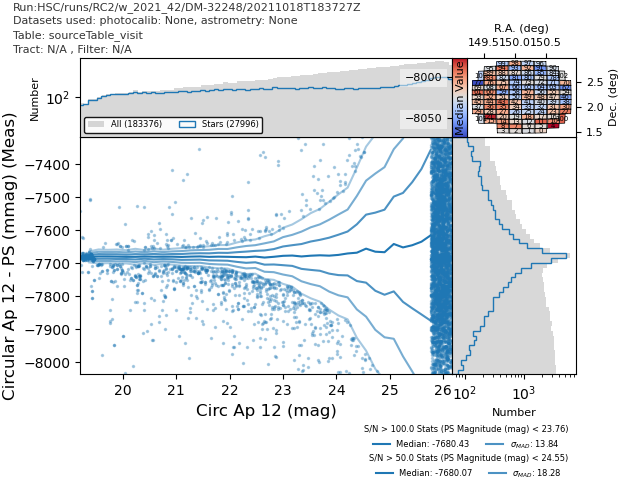
          the DP0 data it was processed with the same pipeline and shares the same
          issues.

    This plot shows the magnitude offset for HSC data, while this is not the DP0
    data it was processed with the same pipeline and shares the same issues.

This issue was fixed before the main processing began.

Large Scale Processing
----------------------
Once the initial data had been studied the large scale processing started.
Plots were made of this data at the visit level. Plots for one, representative,
visit are included here.

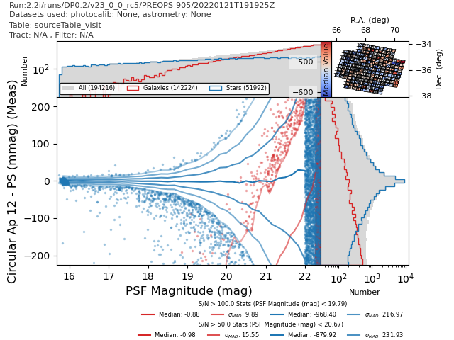
          for stars and galaxies.

    The magnitude for a 12 pixel circular aperture - the PSF magntiude
    for stars and galaxies.

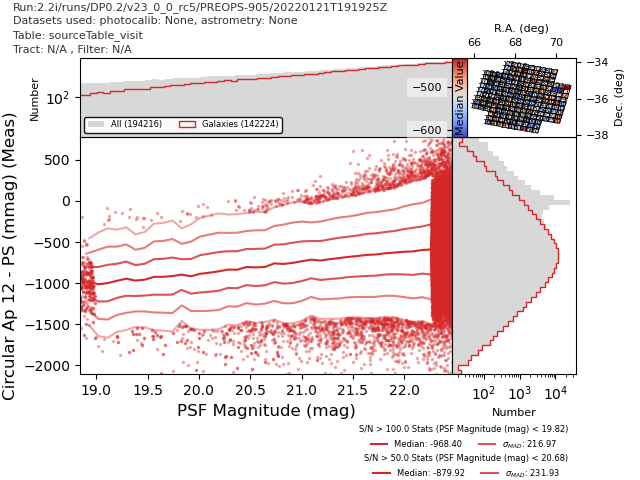
          for just the galaxies.

    The magnitude for a 12 pixel circular aperture - the PSF magnitude for just
    galaxies.

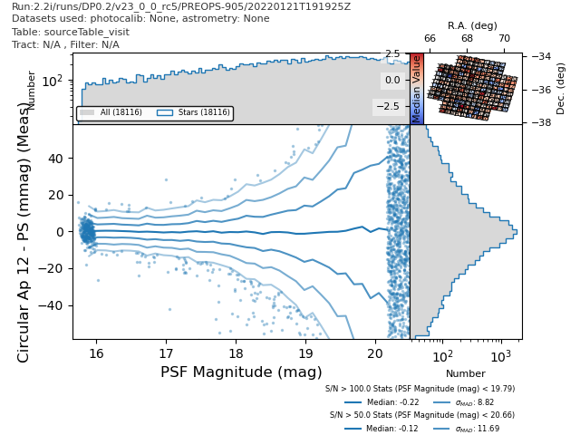
          for stars that were used as calibration sources for the PSF.

    The magnitude for a 12 pixel circular aperture - the PSF magntiude
    for stars that were used as calibration sources for the PSF.

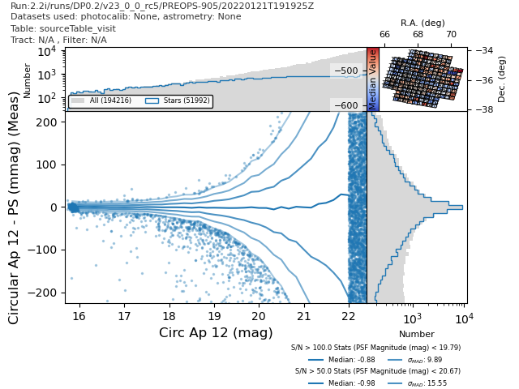
          for stars.

    The magnitude for a 12 pixel circular aperture - the PSF magntiude
    for stars.

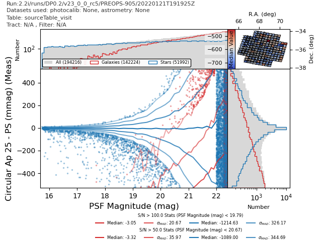
          for stars and galaxies.

    The magnitude for a 25 pixel circular aperture - the PSF magntiude
    for stars and galaxies.

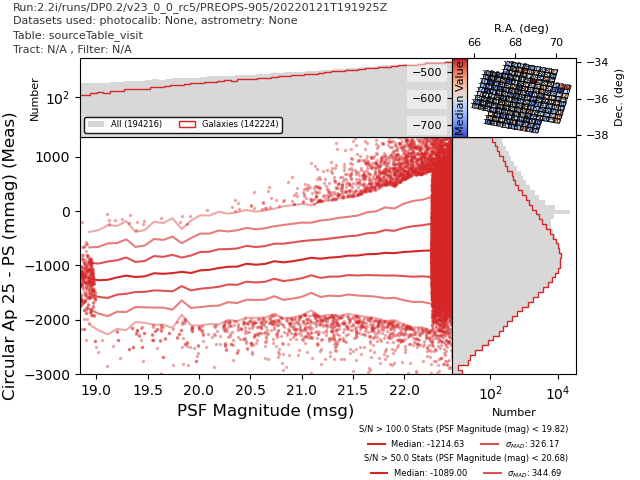
          for galaxies.

    The magnitude for a 25 pixel circular aperture - the PSF magntiude
    for galaxies.

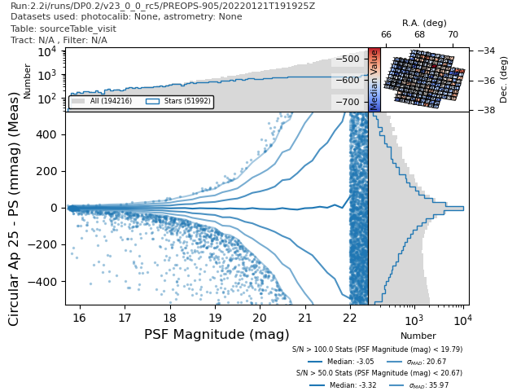
          for stars.

    The magnitude for a 25 pixel circular aperture - the PSF magntiude
    for stars.

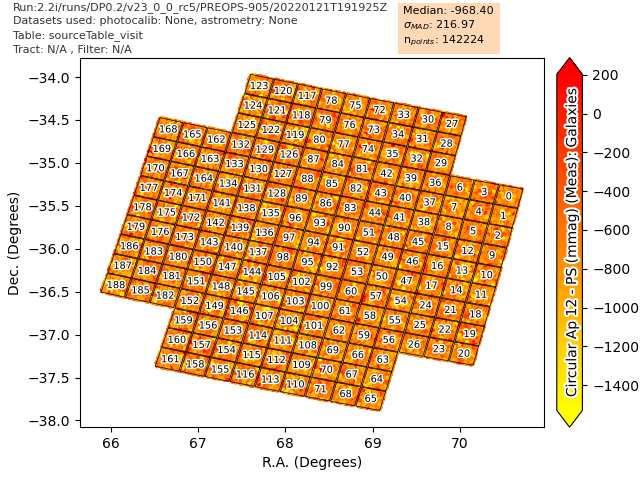
          PSF magnitude for galaxies.

    The sky distribution of the magnitude for a 12 pixel aperture - the
    PSF magnitude for galaxies.

          PSF magnitude for stars used as PSF calibration sources.

    The sky distribution of the magnitude for a 12 pixel aperture - the PSF
    magnitude for stars used as PSF calibration sources.

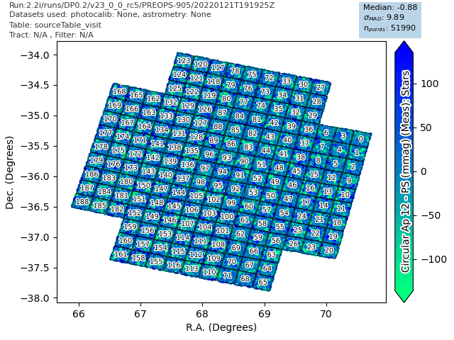
          PSF magnitude for stars.

    The sky distribution of the magnitude for a 12 pixel aperture - the PSF
    magnitude for stars.

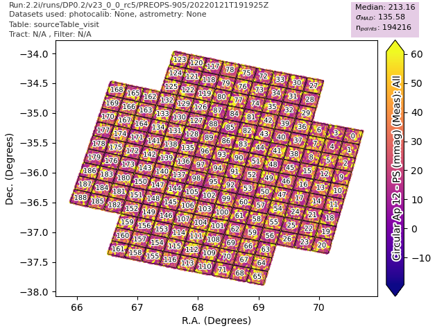

    The sky distribution of the PSF flux SN for all sources.

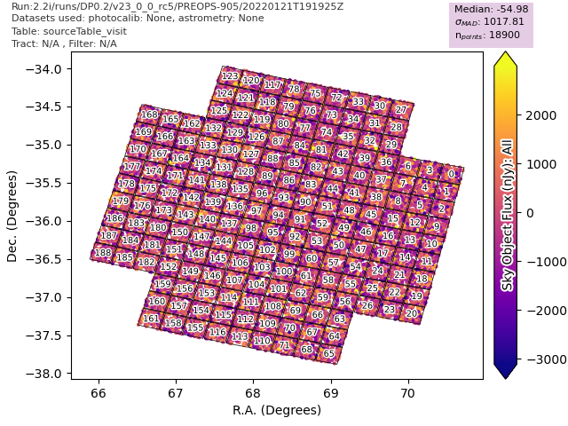

    The sky distribution of the sky object fluxes.

This plots show that the offset seen before has been fixed and don't show up
any other obvious issues. Plots studying the ellipticity were also made and
some examples are given below.

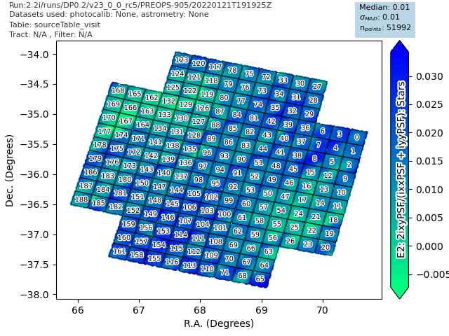

    The sky distribution of E2 (2ixy/(ixx + iyy)) calculated for the PSF.

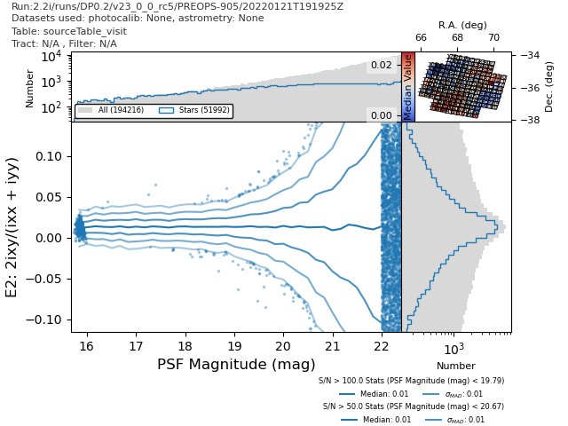
          shape.

    A scatter plot of E2 (2ixy/(ixx + iyy)) calculated for the CModel shape.

More plots are available for a variety of visits and can be viewed through the
plot viewer in the u/sr525 collections.
